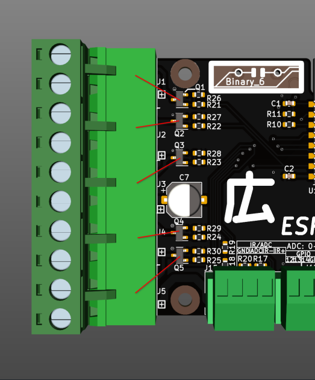

# ESP-Hiro 広 <!-- omit in toc -->

- [What is this?](#what-is-this)
- [Pin tables](#pin-tables)
  - [Devices](#devices)
  - [Example builds](#example-builds)
- [Defined I/O](#defined-io)
  - [MOSFETs](#mosfets)
  - [IR](#ir)
  - [Relays](#relays)
  - [I²C](#ic)
    - [PCF8574](#pcf8574)
    - [Temperature Sensors](#temperature-sensors)
    - [433MHz](#433mhz)
    - [Other](#other)
- [Software](#software)
  - [Tasmota](#tasmota)
  - [Other](#other-1)
- [Build / use](#build--use)
  - [Mechanical](#mechanical)
  - [Building my own](#building-my-own)
  - [Buying](#buying)
  - [Power supply](#power-supply)
  - [Jumpers](#jumpers)
    - [V-USB -> +5V](#v-usb---5v)
    - [PCF8574](#pcf8574-1)
    - [IR resistor](#ir-resistor)
    - [Deep sleep](#deep-sleep)
  - [Uploading the Firmware](#uploading-the-firmware)
- [Tools used](#tools-used)

# What is this?

This is a Tasmota compatible dimmer/actuator/sensor and general purpose smart home interface board to either make various devices smart or create new ones. Typical uses include RGBW dimming, single/multi room heating control, even automating plants!

ESP-Hiro has multiple interfaces directly on board which allow you to connect almost anything you would want to have automated. Some parts like a DHT22 or an IR blaster are basically pre-wired on board, all of the ESP8266's usable GPIO are broken out to plugs/sockets, and since the board was (and still is) pretty empty I've thrown in a PCF8574 port expander in case you might think of a usecase with more pins than the ESP has. 

# Pin tables

## Devices

This table shows the hardware that is enabled on the PCB right away. Obviously other hardware can be connected using the I/O headers as you please. `PD` pins are pulled down, `PU` are pulled up.

|                    | `GPIO2` (PU) | GPIO4 (PU) | GPIO5 (PU) |  GPIO12 (PD)   | GPIO13 (PD) | GPIO14 (PD) | `GPIO15` (PD) |   `GPIO16` (PD)    | `ADC` |
| ------------------ | :----------: | :--------: | :--------: | :------------: | :---------: | :---------: | :-----------: | :----------------: | :---: |
| Header for I/O     |     Temp     |    SDA     |    SCL     |       12       |     13      |     14      |      15       | 16 (HIGH AT BOOT)  |  ADC  |
| I²C                |              |    SDA     |    SCL     |                |             |             |               |                    |       |
| Deep Sleep         |              |            |            |                |             |             |    Disable    |        RST         |       |
| ADC                |              |            |            |                |             |             |               |                    |   X   |
| 433Mhz Transmitter |              |            |            |                |             |             |       X       |                    |       |
| AM2302/DHT22       |      X       |            |            |                |             |             |               |                    |       |
| DS18x20            |      X       |            |            |                |             |             |               |                    |       |
| 2.5 A MOSFET PWM   |              |            |            |      Ch1       |     Ch2     |     Ch3     |      Ch4      | Ch5 (HIGH AT BOOT) |       |
| IR Transmitter     |              |            |            |                |             |             |               |         IR         |       |
| PCF8574            |              |    SDA     |    SCL     | `INT (jumper)` |             |             |               |                    |       |

`GPIO0`   - always pulled HIGH, can't be LOW during boot

`GPIO2`   - always pulled HIGH, can't be LOW during boot

`GPIO15`  - always pulled to GND - can't be HIGH during boot

`GPIO16`  - HIGH during boot, shared with deepsleep wakeup

## Example builds

|                    | `GPIO2` |         GPIO4          |         GPIO5          |     GPIO12     |       GPIO13        |     GPIO14     |   `GPIO15`   |  `GPIO16`   |     `ADC`     |
| ------------------ | :-----: | :--------------------: | :--------------------: | :------------: | :-----------------: | :------------: | :----------: | :---------: | :-----------: |
| Room Controller    |  DHT22  |                        |                        |     PWM R      |        PWM G        |     PWM B      |    PWM W     | PWM Heating |               |
| Switching Actuator | Button  |                        |                        |       Q1       |         Q2          |       Q3       |      Q4      |     Q5      |               |
| IR AC Controller   | DS18S20 |                        |                        |    Button 1    |      Button 2       |                |              |     IR      |               |
| Automated Plant    |  DHT22  | SDA LCD + Light sensor | SCL LCD + Light sensor | FET water pump | FET fertilizer pump |   PWM light    | SR04 Trigger |  SR04 Echo  | Soil Moisture |
| Info Display       |         |        SDA LCD         |        SCL LCD         |   Encoder A    |      Encoder B      | Encoder Button |              |             |               |
| -                  |         |                        |                        |                |                     |                |              |             |               |
| -                  |         |                        |                        |                |                     |                |              |             |               |

# Defined I/O

## MOSFETs

On board MOSFETs can be used to switch or PWM dim loads up to 75 W. Uses include RGB-WW-CW LEDs, heating actuators, small motors/pumps etc. The board can supply 5 A overall, every FET individually can provide up to 2.5 A. Q5 WILL be high at boot, so LEDs connected to this FET will blink once during initial powerup of the board!

- Used FET = AO3400A
- Imax per FET = 2.5 A
- Imax over all FETs = 5 A 
- U = 12 - 24 V

## IR

A header for an IR blaster is present, connected via the MOSFET Q5. It is supplied by 5 V via a jumper configurable current limit resistor of `180 Ohms / 33 Ohms` which works out to around `20 mA / 100 mA` depending on your diodes forward voltage.

`!WATCH OUT!` if you attempt to use an IR LED on J15 and a 24 V device on J5 at the same time you will find that you are connecting the 24 V rail to the 5 V rail through your devices and you will NOT have a fun day! Use ONLY an IR blaster OR a 24 V device at J5!

## Relays

These relay boards can be connected to basically any GPIO from the pin table you want, but you need to disconnect "JD-VCC" jumper and supply 3.3 V to JD so you don't feed 5 V back into the ESP. They can also be connected to the PCF8574 expander header outputs if configured accordingly.

## I²C

- `SDA = GPIO4`
- `SCL = GPIO5`

Any I²C devices supported by Tasmota will work, but remember that some devices already include pullup resistors that need to be removed. For example HD44780 LCDs with PCF8574 I²C backpacks will pull up the I²C lines to 5 V, which could damage the ESP and is not needed since I²C is already pulled up to 3.3 V on ESP-Hiro.

### PCF8574

Right now Tasmota only supports "relay outputs" for PCF8574, but GPIO12 can be connected to the expander interrupt pin with a jumper for future input application. Beware that this needs to apply a pullup to GPIO12 with will turn Q1 on! The address of the PCF8574 has to be set with 3 jumpers as well.

### Temperature Sensors

While you can use any temperature sensor supported by Tasmota, the two predefined variants are DHT22 and DS18B20 type sensors. Both are defined to go on `J9? and use `GPIO02`.

### 433MHz

A 433MHz antenna can be plugged straight onto J10, using pin 2-4, which will use GPIO15 for the RC-Switch library.

### Other

Tasmota does way more than I anticipated so you can use everything that Tasmota provides, even if not specifically defined here. This just happens to be the stuff I regularly use.

# Software

## Tasmota

Under /Tasmota/tasmota-ESP-Hiro/ you will find a precompiled `firmware.bin` built for use with ESP-Hiro, as well as a user_config_override.h file so that you can edit your build to your preferences or usecase.
Using the override file requires you to clone the Tasmota repo and placing the override file inside the `/tasmota/` folder there. 

## Other

Obviously as this is basically another ESP8266 devboard you can code your own software in any language you want. The original design of ESP-Hiro was programmed with Arduino but that made it very "hardcoded to my own home" and not flexible enough for publishing. Tasmota is what sparked the idea of a publishable refresh so just use that!

# Build / use

## Mechanical

This is the mechanical drawing. Under the KiCAD folder /renders you will also find the STEP file for the whole board which makes it easier to design your case around it.
The screwholes are 2.75mm for 2.5mm screws to pass.
Walls around board should be 2mm thick, with 0.2mm space between the board and the wall for the 5.08mm plugs to fit nicely.

## Building my own

As this project is fully open sourced you can obviously make your own boards. The whole board is made to be manufactured by JLCPCB and uses their LCSC parts libraries in the BOM. Using the manufacturing files inside the `KiCAD` folder you can have them build the populated PCB for you, but obviously you can just do them by hand if you want! Obviously SMD soldering skills will be required especially for the USB-C terminal, and parts like the CP2102 are best done with a hot air gun, but these two parts aren't even required if you don't plan to upload code via USB.

Right now there is no build guide for soldering one yourself since this was an exercise in design for manufacturing, specifically to get a fully working module delivered from the PCBA house. 

## Buying

I am in the process of setting up a tindie store or similar and will link it here if you are interested to buy a finished board!

## Power supply

The PCB can be easily supplied via 5 V or 12-24 V depending on your usecase. Only the MOSFETs are exclusively supplied through the 12-24 V DC input, everything else will work on 5 V as well.

To supply the unit via 5 V you can use either the USB Jack or via J10:

12-24 V are supplied via either the barrel jack J7 or the screw-plug terminal J8:

The designed current for this board is a maximum of 5 A through the 24 V terminal, which provides you up to 120 W of dimming power, which is plenty for most at-home LED dimming uses. At least for me. 

Using the 3V3 header also works to supply the ESP, but the IR LED for example won't work anymore as it is supplied by 5 V.

## Jumpers

All jumpers are on the bottom side of the board. 
To use the PCF8574 you will have to set an I²C address on the three jumpers labled A0 - A2 as well as bridge both marked jumpers to power on the PCF (JP6) and connecting the interrupt line (JP8, not strictly required if only outputs are used).

### V-USB -> +5V

This jumper can be used to short out the protection diode between USB and the 5 V rail if you are only using the USB to supply the board. Might save some power for very low power applications and prevents some voltage drop for the IR blaster for example.

### PCF8574

JP6 and JP8 have to be shorted to enable the PCF at all and you will have to set a free address with A0 - A2.

### IR resistor

With JP2 you can choose the current limiting resistor before your IR blaster LED. Shorting the left side yields around 20mA LED current, while the right side yields around 100mA, depending on your diode.

### Deep sleep

Deep sleep will only work if this jumper is bridged. It connects `GPIO16` to the reset line.

## Uploading the Firmware

You best check out the official Tasmota guides for this, as it won't differ from any other ESP8266 board. There is a CP2102 serial converter behind the USB jack so for most systems the board will be plug-and-play to upload via USB. The serial design generally mimics the NodeMCU way of things. TXD and RXD pins are NOT broken out to headers so if you want to upload code without USB you would have to solder directly to the generous pins of the ESP directly!

# Tools used

The schematic, PCB and screenshot renders were done in __[KiCAD](https://kicad.org/)__, specifically using the nightly build `5.99.0-10216-g675444a646`. The whole KiCAD project, all design files and manufacturing outputs are found under the KiCAD folder, including the schematic etc.

All the 3d printable files are done in __[FreeCAD](https://www.freecadweb.org/)__ 0.20 dev versions. Find all 3d printable files in the FreeCAD folder as well as on __[Prusaprinters.org](https://www.prusaprinters.org/social/13425-chrismettal/prints)__. 

Models are printed on __[Prusa](https://www.prusa3d.com/)__ MK3s printers and sliced with Prusaslicer. 